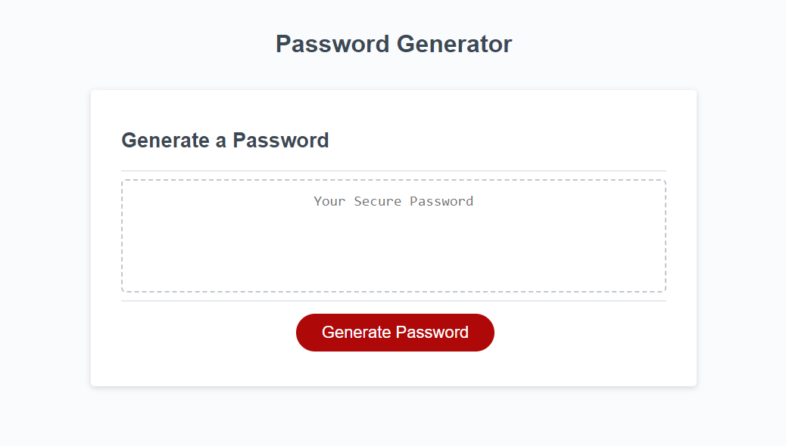
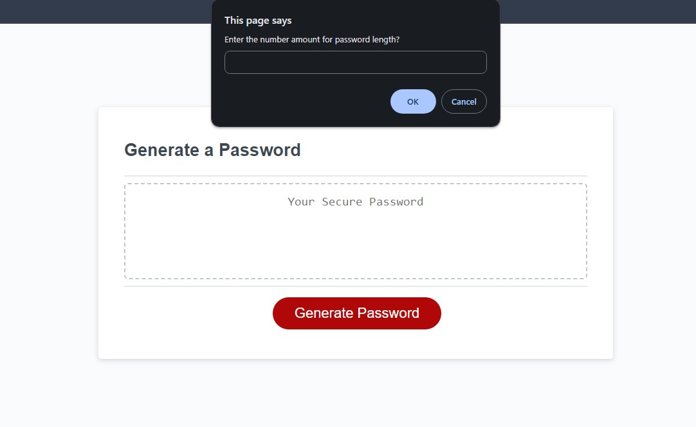
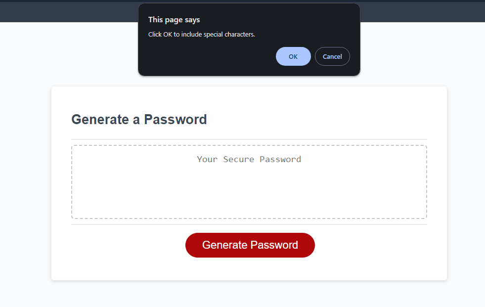
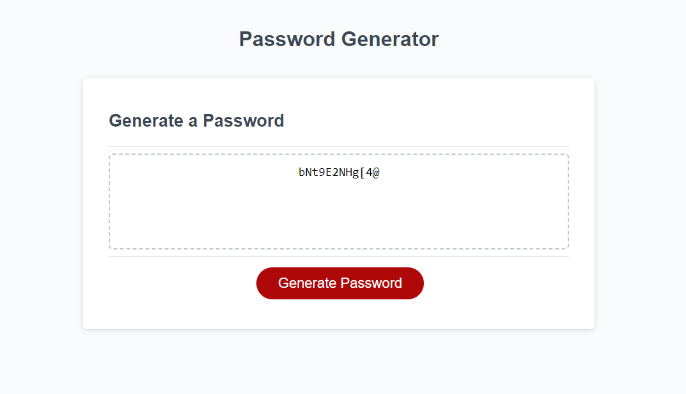

# Password Generator Called Shazam
>### Module 3-Javascript Password Generator

>Using the lessons I learn from class I was able to create a password random generator for any user looking to create a new password. The web application uses JavaScript code to create a random generator alogn with HTML and CSS.



## Direction 

Clone the respository:

```sh
git clone git@github.com:DecodePlaymaker/shazam.git
```
1. Open Git Bash

2. Change the current working directory to the location 

3. Type git clone and paste the url

4. Finally press Enter to create a local clone


## Password Generator Usage

* You will be prompted to enter the desired length of the password with characters when clicking generate password.
 


* A box will pop up confirming the requirement of special and numerics characters for the password.



* A new password will be generated after clicking OK.


## Deployed Application
* Live URL: https://decodeplaymaker.github.io/shazam/

## Resource
use webpages like mdn web docs to help me better under stand javascript.
https://developer.mozilla.org/en-US/docs/Web/API/EventTarget/addEventListener